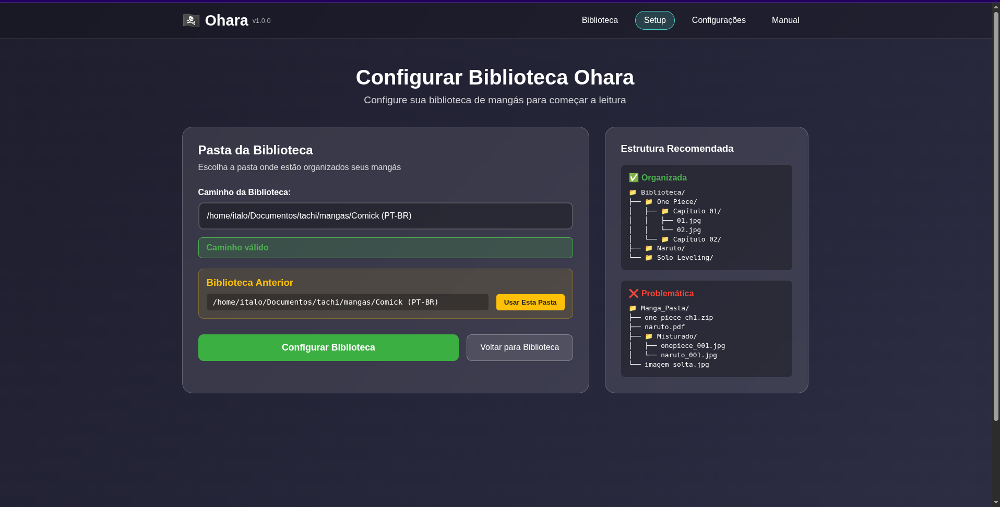
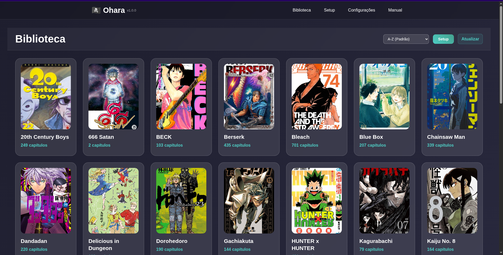
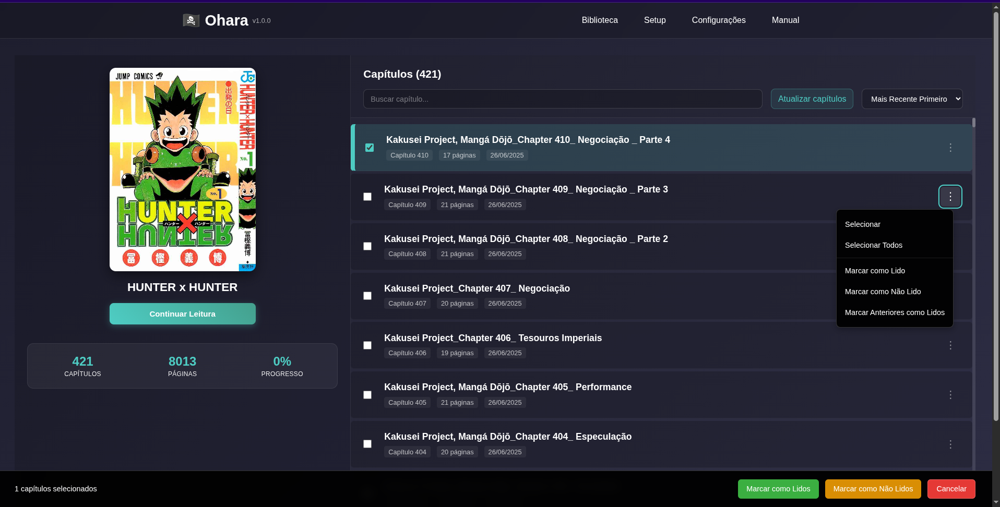
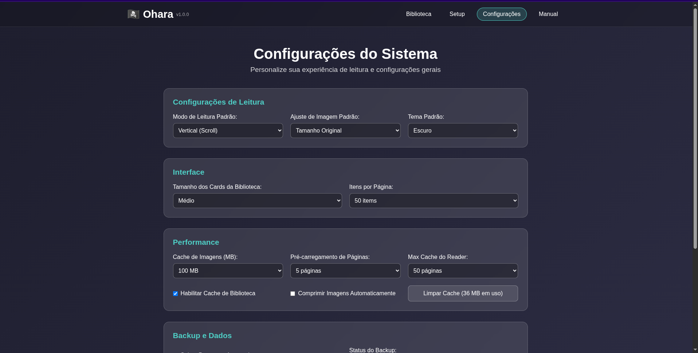
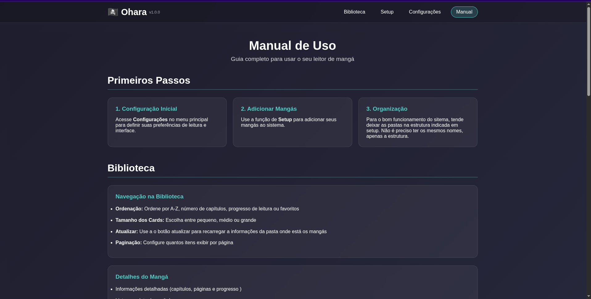

# Ohara - Local Manga Reader

## System Description

Web system for reading locally organized manga. Ohara scans folder structures containing manga, automatically organizes them by chapters, and offers an intuitive interface for reading with progress tracking.

**Key Features:**
- Automatic scanning of manga libraries
- Automatic organization by manga and chapters
- Responsive reading interface with page navigation
- Hybrid cache system for high performance
- Reading progress tracking
- Image serving with security validation

## Screenshots

<div align="center">

### Main Interface


### Manga Library


### Chapter Navigation


### Reading Page


### Settings


### Manual


</div>

## Demo

[](https://drive.google.com/file/d/1bKGaJUDB9N8PcIlHpFAIDg3FMZxMzKZJ/view?usp=sharing)

*Click the image above to watch the system demonstration video*

## Technologies Used

**Frontend:**
- Vue.js 3 (Composition API)
- Vue Router 4 - Routing
- Pinia - State management
- Vite - Build tool and dev server
- Axios - HTTP Client

**Backend:**
- FastAPI - Python web framework
- Uvicorn - ASGI Server
- Pydantic - Data validation
- Python 3.10+

**Storage:**
- JSON - Data and local cache
- LocalStorage - User settings

## How to Run

### Prerequisites
- Python 3.10+
- Node.js 18+ and npm
- Git

### 1. Clone Repository
```sh
git clone git@github.com:Dellareti/ohara.git
cd ohara
```

### 2. Backend
```sh
cd backend
python -m venv venv
source venv/bin/activate  # Linux/Mac
# venv\Scripts\activate   # Windows
pip install -r requirements.txt
python -m app.main
```
**Backend:** http://localhost:8000  
**API Docs:** http://localhost:8000/api/docs

### 3. Frontend
```sh
cd frontend
npm install
npm run dev
```
**Frontend:** http://localhost:5173

## Library Structure

Ohara expects this type of organization, and it is recommended:

```
library/
├── Berserk/
│   ├── cover.jpg                   # Thumbnail (optional)
│   ├── Chapter 1/
│   │   ├── 001.jpg
│   │   ├── 002.jpg
│   │   └── 003.jpg
│   └── Chapter 2/
│       └── ...
├── One Piece/
│   ├── Ch 1/
│   └── Ch 2/
└── Hunter x Hunter/
    ├── Ch 1/
    └── Ch 2/
```

**Supported Formats:**
- Images: JPG, JPEG, PNG, GIF, WebP, BMP
- Any folder name is accepted
- Automatic chapter detection

## Supported Languages

Ohara automatically detects chapter and volume numbers from folder names written in 11 languages. Libraries with mixed-language folders are supported.

| Language   | Chapter format                  | Abbreviation   | Volume + Chapter             |
|------------|---------------------------------|----------------|------------------------------|
| English    | `Chapter 1`                     | `Ch. 1`        | `Vol. 1 Ch. 2`               |
| Portuguese | `Capítulo 1`                    | `Cap. 1`       | `Tomo 1 Capítulo 2`          |
| Spanish    | `Capítulo 1`                    | `Cap. 1`       | `Tomo 1 Capítulo 2`          |
| French     | `Chapitre 1`                    | `Chap. 1`      | `Tome 1 Chapitre 2`          |
| German     | `Kapitel 1`                     | `Kap. 1`       | `Band 1 Kapitel 2`           |
| Italian    | `Capitolo 1`                    | `Cap. 1`       | `Tomo 1 Capitolo 2`          |
| Russian    | `Глава 1`                       | `Гл. 1`        | `Том 1 Глава 2`              |
| Japanese   | `第1話`, `第1章`, `1話`          | —              | —                            |
| Chinese    | `第1章`, `第1回`, `第1话`        | —              | —                            |
| Hindi      | `अध्याय 1`, `भाग 1`              | —              | —                            |
| Arabic     | `الفصل 1`, `فصل 1`              | —              | —                            |

**Cover filenames recognized** (optional, placed in the manga root folder): `cover`, `thumb`, `thumbnail`, `capa` (PT), `portada` (ES), `couverture` (FR), `umschlag` (DE), `copertina` (IT), `обложка` (RU), `表紙` (JA), `封面` (ZH), `आवरण` (HI), `غلاف` (AR).

Numeric-only folder names like `001`, `1.5`, or `1 - Title` are also recognized in any language.

## Architecture

### Backend (FastAPI)
- **MangaScanner**: Scans and indexes libraries
- **SimpleCache**: Intelligent cache based on timestamps
- **LibraryState**: Global library state
- **REST API**: Secure endpoints for communication
- **Image Server**: Serves images with validation

### Frontend (Vue.js)
- **Stores (Pinia)**: Library, Reader, Settings
- **Components**: Library, Reader, Settings, Manual
- **Services**: API client with interceptors
- **Router**: Navigation with guards

## Main Endpoints

### Library
- `POST /api/scan-library` - Scan library
- `GET /api/library` - Get current library
- `GET /api/validate-path` - Validate path

### Manga and Chapters
- `GET /api/manga/{manga_id}` - Manga details
- `GET /api/manga/{manga_id}/chapter/{chapter_id}` - Chapter pages

### Progress
- `POST /api/progress/{manga_id}/{chapter_id}` - Save progress
- `GET /api/progress/{manga_id}` - Get progress

### Utilities
- `GET /api/image?path=` - Serve images
- `GET /api/cache/info` - Cache status
- `GET /health` - Health check

## Performance

### Hybrid Cache
- **Change detection**: Only reprocesses modified files
- **90% faster**: On re-scans
- **Intelligent**: Based on modification timestamps

## Tests

```bash
# Backend - All tests
cd backend
pytest
```

# With coverage
```bash
pytest --cov=app --cov-report=html
```

# Specific tests
```bash
pytest tests/unit/api/
pytest tests/unit/models/test_manga.py
```

## Troubleshooting

### Common Issues

**"Folder contains no subdirectories"**
- Check that there are manga folders in the library
- Make sure manga folders have chapter subfolders

**"Path not found"**
- Confirm the path exists and is correct
- Check read permissions
- Avoid special characters in the path

**"Images not loading"**
- Confirm supported formats (JPG, PNG, GIF, WebP)
- Check that the backend is running on port 8000
- Clear cache: go to http://localhost:8000/api/cache/clear

**"Slow performance"**
- Check cache: http://localhost:8000/api/cache/info
- Avoid libraries on network drives
- Consider using an SSD for large libraries

### Debug and Logs
```bash
# System status
curl http://localhost:8000/health
curl http://localhost:8000/api/cache/info
curl http://localhost:8000/api/debug

# Detailed logs
cd backend
python -m app.main  # Logs appear in the terminal
```
